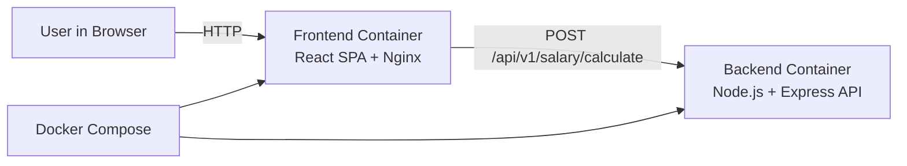

# 🏗️ Software Architecture – Gehalt Rechner

## 1. Architectural Goals 🎯

The architecture of the _Gehalt Rechner_ application is designed to:

- clearly separate frontend and backend responsibilities,
- ensure maintainability and extensibility,
- support automated testing,
- allow containerized deployment.

The architecture follows established best practices for modern web applications.

---

## 2. Architecture Model 🧩

The system architecture is described using a **C4-inspired container-level model**, focusing on the main software containers and their interactions.

This level of abstraction is appropriate for explaining system structure without unnecessary implementation detail.

### C4 Container Diagram (Mermaid)

---

## 3. System Overview 🌐

The application consists of three main components:

1. **User (Browser)**
2. **Frontend Container (SPA)**
3. **Backend Container (API)**

These components communicate via HTTP and exchange data in JSON format.

---

## 4. Frontend Architecture 🎨

### Responsibilities

- Provide the user interface
- Collect and validate user input
- Send calculation requests to the backend
- Display net salary and deduction breakdown

### Technical Characteristics

- Implemented as a **Single Page Application (SPA)**
- Built with React and TypeScript
- Runs as a static build served by a web server
- Communicates with backend via REST API

The frontend contains no business logic related to salary calculation, ensuring a clear separation of concerns.

---

## 5. Backend Architecture 🔧

### Responsibilities

- Validate incoming request data
- Perform salary calculations
- Apply simplified tax and contribution rules
- Return structured calculation results
- Expose a stable REST API

### Core Endpoint

- `POST /api/v1/salary/calculate`

### Technical Characteristics

- Implemented using Node.js and Express
- Written in TypeScript
- Uses schema validation for input safety
- Covered by unit and integration tests

All business logic is centralized in the backend to ensure consistency and testability.

---

## 6. Data Flow 🔄

1. The user enters salary data in the browser.
2. The frontend sends a request to the backend API.
3. The backend validates the input data.
4. The backend calculates the net salary and deductions.
5. The backend returns a JSON response.
6. The frontend renders the results for the user.

This unidirectional data flow improves clarity and debuggability.

---

## 7. Deployment Architecture 🐳

The application is deployed locally using **Docker Compose**:

- **Frontend container**
  - Contains the built SPA
  - Serves static files
- **Backend container**
  - Runs the API server
- **Docker Compose**
  - Orchestrates both containers
  - Enables one-command startup

This approach ensures reproducible environments and simplifies deployment.

---

## 8. Architectural Decisions & Rationale 🧠

Key architectural decisions include:

- SPA architecture for responsive user interaction
- Backend-driven business logic for maintainability
- Containerization for consistency across environments
- Clear API contract between frontend and backend

These decisions support scalability, clarity, and alignment with course requirements.

---

## 9. Compliance with Task Requirements 🎓

The architecture fulfills all architectural aspects of the task by:

- integrating frontend and backend into a coherent system,
- documenting components and their relationships,
- supporting containerized execution,
- enabling testing and future extensibility.
